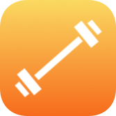

# nSuns 5/3/1 iOS  

## Mission

I created this app during my vacation in the summer of 2017 as I was trying out this awesome weightlighting program I found on reddit. Even though I never intended to release this to the public after being quite content with its functionalities in the gym I decided to release this to the public. For free to give something back to the awesome community. Since then I maintained and improved the app with many new features, new templates and all around more customizability. My goal is to bring the best experience for weight training with this program to iOS. Tailored to the platform in an intuitive and delightful way. 
All of this was and is only possible because of the amazing support I get from the community via bug reports, feature requests or just all around friendly support. I had and still have a lot of fun working on this side project also thanks to all of you guys. 

## The program

nSuns 5/3/1 is a weightlifting program losely-based on Jim Wendler's 5/3/1 programs that was developed by reddit user u/nSuns. Regarding the actual program you can find a whole lot of resources, information and support from like minded people on [reddit](https://www.reddit.com/r/nsuns). 

## Feature requests & Bugs

[This](https://github.com/JonnyBeeGod/nSuns-5-3-1-iOS-issues) is the public issue tracking system for the [nSuns 5/3/1][1] iOS app. This is the place for feature requests, bug reporting and general questions regarding the app. For feature requests please provide a proper description on exactly what problem you'd like to see solved. For bug reports please also provide the necessary steps to reproduce the problem. 

Please search the existing issues before submitting a new issues first, maybe there is already an issue for your problem. You can +1 vote 👍 on existing issues you'd like to see implemented to generate extra pressure on me :) 
Thank you for contributing.

Links
-------------
- [App Store][1]
- [/r/nSuns][2] subreddit for questions regarding the program
- [/u/JonnyBeeGod][3] get in touch with me directly

[1]: https://itunes.apple.com/us/app/nsuns-5-3-1/id1265494052?mt=8
[2]: https://www.reddit.com/r/nSuns/
[3]: https://www.reddit.com/user/JonnyBeeGod/
